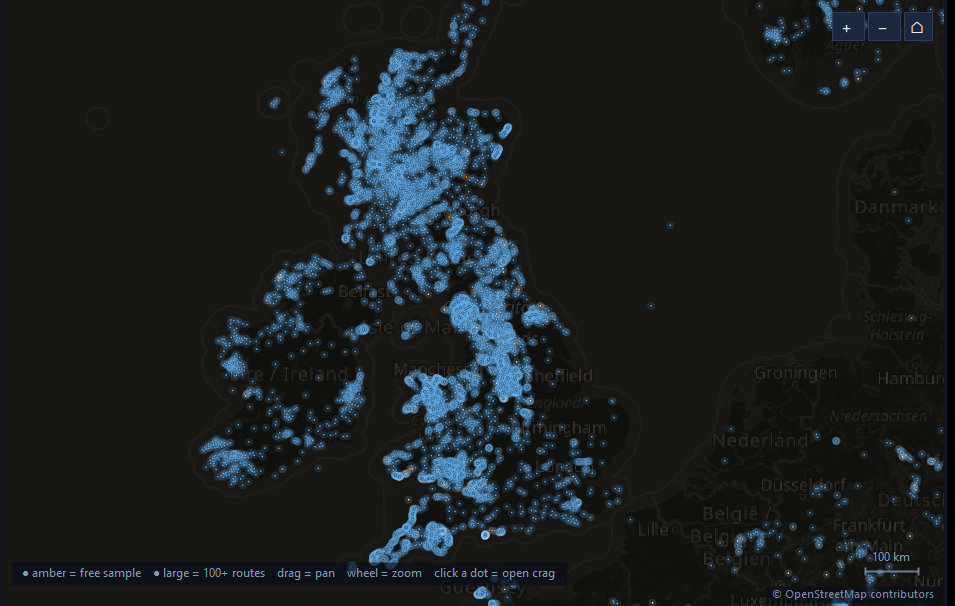
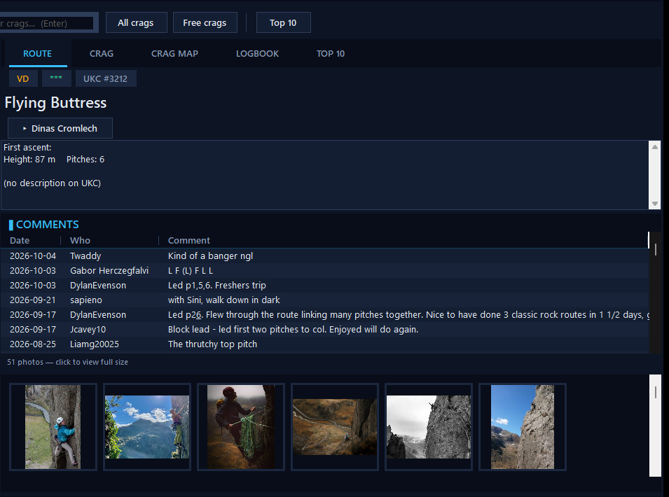

# RockfaxApi — unofficial C# client for the Rockfax / UKClimbing app API

| Crag map (~26,600 crags, free samples in amber) | Route page (comments, photos) |
|---|---|
|  |  |

Reverse engineered from the Rockfax Android app (`com.rockfax.rockfax.rockfax`, version code 3100).
Everything here replicates what the app's `com.rockfax.rockfax.ukcapi` package puts on the wire.

> ## Disclaimer
> This project is **unofficial** and not affiliated with, endorsed by, or supported by
> Rockfax or UKClimbing. It exists for personal interoperability and research: use **your
> own account**, keep request volumes reasonable, and expect the API, its constants, or its
> Cloudflare configuration to change without notice. Nothing here bypasses payment or
> entitlement checks — paid guidebook content requires an account that has actually
> purchased it. If you are the API owner and want this taken down, open an issue.

## Getting started

```bash
git clone https://github.com/Siroro/rockfax-api.git
cd rockfax-api

# build the library (net8.0, no NuGet dependencies)
dotnet build RockfaxApi.csproj

# run the console demo — public endpoints need no account
dotnet run --project RockfaxApi.Demo -- free-crags
dotnet run --project RockfaxApi.Demo -- top10
dotnet run --project RockfaxApi.Demo -- search "Stanage"
dotnet run --project RockfaxApi.Demo -- route-info 9860

# authenticated endpoints use your UKClimbing credentials
dotnet run --project RockfaxApi.Demo -- login you@example.com password
dotnet run --project RockfaxApi.Demo -- logbook you@example.com password
```

Or use the library directly:

```csharp
using RockfaxApi;

using var client = new RockfaxClient();
using var doc = await client.GetFreeCragsAsync();
```

Fully self-contained on Windows: the default WinHTTP transport needs no external binaries.

## How the API works

Two services:

| Service | Base URL | Notes |
|---|---|---|
| UKC "php" API (main) | `https://app-live.ukclimbing.com` | everything below unless noted |
| Node API | `https://dev.api.rfd.lol` | `POST /v1/rockfax/featured_areas` only |

(The app also ships `https://app-dev.ukclimbing.com` for dev builds.)

### 1. The `key` path segment

Every route starts with a key segment, e.g.
`/and_1a2b3c4d5e6f/logbook/v1/crag_ukc/123%7C456`.

```
key = "and_" + md5(keyInput + "lfoengoir").substring(17, 29)
```

`keyInput` per endpoint:

| keyInput | Endpoints |
|---|---|
| `""` (empty) | all POSTs, `store/v1/freeCrags/`, `photos/v1/weekly_top10_{site}` |
| `"123%7C456"` (pipe-encoded ids) | crag details, crag routes route comments, route photos, crag photos, photo counts, weather |
| `"t=<unixtime>"` | `crags_ukc`, `listings/v1/free` |
| `"userID=<id>"` | wishlist, partners, logbook route details |
| `"userID=<id>&t=<unixtime>"` | logbook |
| `"<routeId>"` | route info, crag routes |
| URL-encoded search text | route search |

### 2. Auth headers (logged-in requests)

The app attaches these to **every** request once logged in
(`UKCAPIRequestInterceptor`); anonymous requests go out bare:

```
Cookie:                     api_auth=<accessToken>:<deviceId>;
rfdigital-access-token:     <accessToken>
rfdigital-request-date:     2026-10-05T14:23:09        (local time, yyyy-MM-dd'T'HH:mm:ss)
rfdigital-api-key:          md5(requestDate + path + query + body + "b916246d1b133943156cd8e0d7d65ee2")
```

- `path` is the URL-encoded path (`|` appears as `%7C`), `query` is `""` when absent,
  `body` is the exact form/JSON string (empty for GETs).
- `deviceId` is a random UUID truncated to 31 chars, generated per install.

### 3. Login / token lifecycle

- `POST {key}/user/v1/auth_ukc` — form fields `email`, `password`, `deviceID`, `device_name`.
  Response JSON: `{ userID, username, refreshToken, expires }` (unix seconds) plus
  `Set-Cookie: api_auth=<accessToken>:<deviceId>`.
- `POST {key}/user/v1/refresh_ukc` — form fields `userID`, `refreshToken`, `deviceID`; same response shape.
- The client auto-refreshes when within a day of expiry.

## Endpoint reference (all implemented on `RockfaxClient`)

| Method | Route | Client method |
|---|---|---|
| POST | `{key}/user/v1/auth_ukc` | `LoginAsync` |
| POST | `{key}/user/v1/refresh_ukc` | `RefreshAccessTokenAsync` |
| POST | `{key}/user/v1/app_permissions_v3/` | `GetAppPermissionsAsync` |
| GET | `{key}/logbook/v1/crag_{site}/{ids}` | `GetCragDetailsAsync` |
| GET | `{key}/logbook/v1/crag_routes_ukc/{id}` | `GetCragRoutesAsync` |
| GET | `{key}/logbook/v1/crags_ukc/t={t}` | `GetCragMarkersAsync` |
| GET | `{key}/logbook/v1/logbook_{site}/userID={id}&t={t}` | `GetLogbookAsync` |
| GET | `{key}/logbook/v1/logbook_route_details_{site}/userID={id}` | `GetLogbookRouteDetailsAsync` |
| GET | `{key}/logbook/v1/partners/userID={id}` | `GetPartnersAsync` |
| GET | `{key}/logbook/v1/wishlist_{site}/userID={id}` | `GetWishlistAsync` |
| GET | `{key}/logbook/v1/route_comments_{site}/{ids}` | `GetRouteCommentsAsync` |
| GET | `{key}/logbook/v1/route_info_ukc/{id}` | `GetRouteInfoAsync` (typed) |
| GET | `{key}/logbook/v1/app_search_route_ukc/{query}` | `SearchRoutesAsync` |
| GET | `{key}/logbook/v2/weather_{site}/{ids}` | `GetWeatherAsync` (note: v2) |
| POST | `{key}/logbook/v1/logbook_add_{site}/` | `AddAscentsAsync` |
| POST | `{key}/logbook/v1/wishlist_add_{site}/` | `AddWishlistAsync` |
| POST | `{key}/logbook/v1/partner_add/` | `AddPartnerAsync` |
| GET | `{key}/store/v1/freeCrags/` | `GetFreeCragsAsync` |
| GET | `{key}/photos/v1/check_crags_{site}/{ids}` | `GetCragPhotoCountsAsync` |
| GET | `{key}/photos/v1/crag_{site}/{ids}/{timestamp}` | `GetCragPhotosAsync` |
| GET | `{key}/photos/v1/{listingType}_photos/{ids}` | `GetListingPhotosAsync` |
| GET | `{key}/photos/v1/route_{site}/{ids}` | `GetRoutePhotosAsync` |
| GET | `{key}/photos/v1/weekly_top10_{site}` | `GetWeeklyTopTenPhotosAsync` |
| GET | `{key}/listings/v1/free/t={t}` | `GetFreeListingsAsync` |
| POST | `{key}/analytics/v1/timesplit/` | `UploadUsageAnalyticsAsync` |
| POST | `/v1/rockfax/featured_areas` (node API) | `GetFeaturedAreasAsync` |

`{site}` ∈ `ukc` | `rockfax` | `ukh` (`Site` enum). `{ids}` are `|`-joined (`%7C` on the wire).

Guidebook purchases/subscriptions gate the content downloads (Google Play billing +
`storage.googleapis.com/rockfax_app/...` + `cdn.ukc2.com` images) — that flow is
outside this client's scope; only the REST API above is replicated.

## Transport / Cloudflare

`app-live.ukclimbing.com` sits behind Cloudflare bot management. Empirically (Oct 2026):

- .NET's `SocketsHttpHandler` receives a managed challenge (`403`, `cf-mitigated: challenge`)
  for **every** request, regardless of headers, HTTP version or TLS version — the TLS
  fingerprint is what's scored.
- Windows' native WinHTTP stack (and curl's Schannel TLS) are served normally, **provided**
  the request carries the app's User-Agent (`okhttp/3.8.0` — the version bundled in the APK).
- Nothing here forges or impersonates a fingerprint: the default transport is
  `WinHttpTransport`, a thin P/Invoke wrapper over the OS `winhttp.dll` — fully
  in-process, no external binaries, no subprocesses. Alternatives via the
  `RockfaxTransport` enum: `Managed` (plain `SocketsHttpHandler`; currently challenged)
  and `Curl` (spawns the Windows-bundled `curl.exe`; kept as a fallback).

```csharp
// default: WinHTTP (Windows)
using var client = new RockfaxClient();

// opt-in alternatives
using var curl   = new RockfaxClient(transport: RockfaxTransport.Curl);
using var managed = new RockfaxClient(transport: RockfaxTransport.Managed);
```

## Usage

```csharp
using var client = new RockfaxClient(); // persists DeviceId if you want a stable install id

// public endpoints work anonymously
using JsonDocument crags = await client.GetFreeCragsAsync();

// login with your UKClimbing account
AuthResponse session = await client.LoginAsync("you@example.com", "password");
using JsonDocument logbook = await client.GetLogbookAsync(client.UserId);

// upload an ascent
await client.AddAscentsAsync(client.UserId, new[]
{
    new AscentUpload { RouteUkcId = 52150, StyleId = 20, AscentDate = "2026-10-05", Notes = "great" },
});
```

## Desktop app

`RockfaxDesk` is a WinForms front-end (net8.0-windows) built on the library — a dark,
screenshot-tested UI (`shot.ps1` + `--goto/--search/--crag/--top10/--freecrags` dev hooks
drive it headlessly for captures):

- **Route pages** — grade/star chips, description, first ascent, height/pitches,
  the live community comments thread, and a filmstrip photo gallery (click for a
  full-size lightbox; `←`/`→` or the wheel steps through the strip; thumbnails
  fall back to full images when the CDN lacks a t_300h variant). "on UKC" opens the
  crag on ukclimbing.com.
- **Crag pages** — clickable grade-band chips (Mod-VD / S-HS / VS-HVS / E1+) that
  filter the buttress-grouped route list, a seven-day weather card strip, crag
  photos, and an "on UKC" link.
- **Crag map** — every UKC crag as a pannable, zoomable dot plot with a degree
  graticule, glow-by-popularity, hover labels, on-canvas zoom controls, double-click
  zoom, and free-sample crags in amber. Opening a crag anywhere rings its dot here.
  The viewport is pinned to Britain + Ireland because the marker feed contains
  overseas crags and bad rows.
- **Search & lists** — route search (Enter), crag filter, busiest-crags, free crags.
- **Logbook** — sign in with your UKClimbing account for your ascents (UKC style
  names decoded, **climbing partners resolved to names**, CSV export) with a live
  filter box, and your wishlist (grade/id columns, deleted entries skipped);
  double-click any ascent or wishlist entry to open the route.
- **Top 10** — the weekly photo grid with rank badges and ratings, refreshable.
- **Shell** — hover-highlighted lists, a loading spinner in the status bar, buttons
  lock while a request is in flight, failures render in red, window/splitter
  geometry persists across runs, and a "?" About box lists attribution + shortcuts.
- Keyboard: **Ctrl+F** focuses search, **Enter** searches/opens, **Esc** clears,
  **F5** refreshes the current route/crag/list.

```bash
dotnet run --project RockfaxDesk            # GUI
dotnet run --project RockfaxDesk -- --self-test   # headless end-to-end check against the live API
```

The self-test exercises every data path the UI uses (search, route info, comments,
crag routes, weather, photo metadata, a CDN thumbnail download, top-10, form construction).

Console demo (`RockfaxApi.Demo`):

```
dotnet run --project RockfaxApi.Demo -- free-crags
dotnet run --project RockfaxApi.Demo -- route-info 52150
dotnet run --project RockfaxApi.Demo -- login you@example.com password
```

## Build

```
dotnet build RockfaxApi.csproj    # library, net8.0, no NuGet dependencies
```
